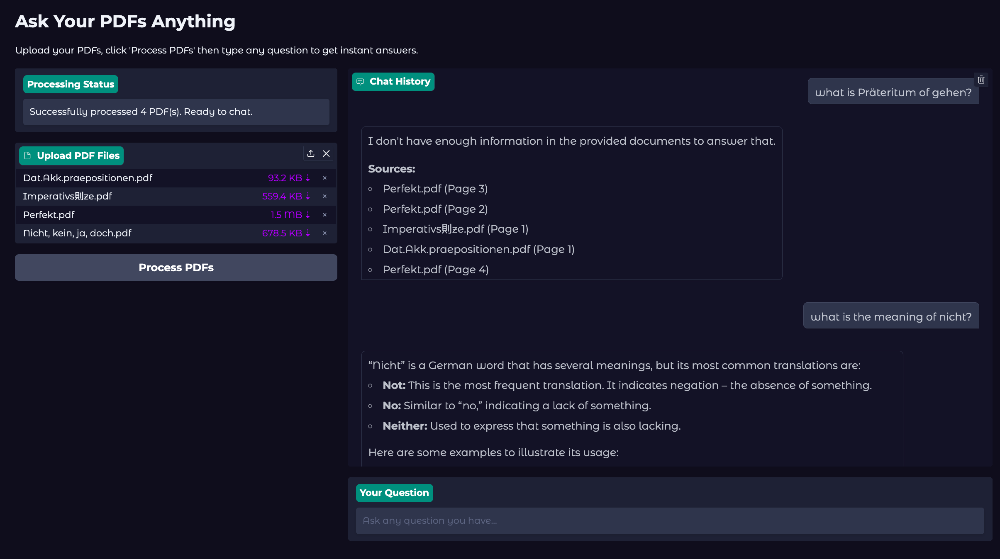

# Chat with PDFs AI Chatbot

This project implements a Python-based chatbot that allows users to upload PDF documents and interactively ask questions about their content using an AI model.

## Prerequisites

Before you begin, ensure you have the following installed:

1. **uv**: A fast Python package installer and resolver.
2. **Ollama**: A tool to run large language models locally.


*Example of the working application where users can upload PDFs and chat with an AI about the document content.*

## Installation

### 1. Install uv

Follow the official instructions to install `uv` on your system:
[https://docs.astral.sh/uv/getting-started/installation/](https://docs.astral.sh/uv/getting-started/installation/)

For example, on macOS and Linux:
```bash
curl -LsSf https://astral.sh/uv/install.sh | sh
```

### 2. Install Project Dependencies

Clone this repository and navigate into the project directory. Then, use `uv` to install the required Python packages:

```bash
cd chat-with-pdfs
uv sync 
```

### 3. Install Ollama

Download and install Ollama from the official website:
[https://ollama.com/](https://ollama.com/)

Follow the installation instructions provided for your operating system.

### 4. Download the AI Model

Once Ollama is installed, download the `gemma3:4b` model:

```bash
ollama run gemma3:4b
```

You also need the embedding model:
```bash
ollama pull mxbai-embed-large
```

This command will download the model if it's not already present and start an interactive session. You can exit the session after the download is complete.

## Running the Application

(Instructions on how to run your Python chatbot application will go here once implemented.)


