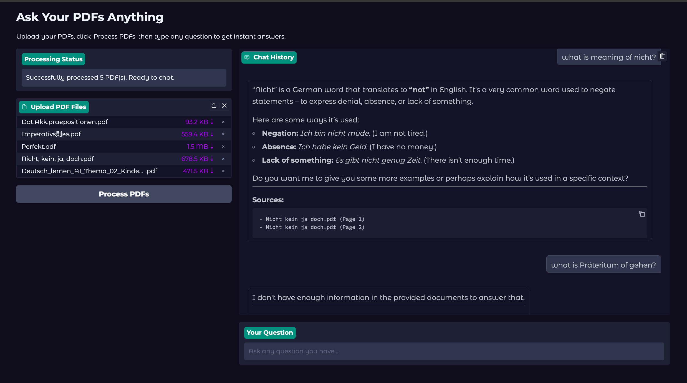

# Chat with PDFs AI Chatbot

An AI-powered assistant that lets you upload PDF documents and chat with them interactively.


## Overview

Chat with PDFs AI is an intelligent tool that:
1. Analyzes uploaded PDF documents
2. Understands and indexes the content using local AI models
3. Enables you to ask questions and get precise answers instantly

This application uses Retrieval-Augmented Generation (RAG), a powerful AI technique that enhances large language models with specific knowledge from your documents.

Perfect for researchers, students, professionals, or anyone who needs fast insights from lengthy documents!

## Features

- 📄 **PDF Upload & Parsing**: Upload one or multiple PDF files
- 🧠 **Local AI Understanding**: No cloud required — runs fully offline using Ollama models
- 💬 **Conversational Interface**: Ask natural language questions about your documents
- 🔍 **RAG Architecture**: Utilizes Retrieval-Augmented Generation for accurate, document-grounded responses
- ⚡ **Fast & Efficient**: Embedding and retrieval optimized for quick responses
- 🔒 **Privacy-Friendly**: Your documents never leave your machine

  
*Example of the application: upload PDFs and interact with an AI assistant to explore document content.*


## Installation

### 1. Clone the Repository
```bash
git clone https://github.com/yourusername/chat-with-pdfs.git
cd chat-with-pdfs
```

### 2. Install uv

Install `uv`, a fast Python package manager:  
Follow the official instructions here: [https://docs.astral.sh/uv/getting-started/installation/](https://docs.astral.sh/uv/getting-started/installation/)

For example, on macOS and Linux:
```bash
curl -LsSf https://astral.sh/uv/install.sh | sh
```

### 3. Install Project Dependencies

Once `uv` is installed, sync the project environment:
```bash
uv sync
```

### 4. Install Ollama

Download and install Ollama to run AI models locally:  
[https://ollama.com/](https://ollama.com/)

Follow the installation guide for your operating system.

### 5. Download Required AI Models

After installing Ollama, pull the models used for understanding and embedding:

1. **Main language model**:
```bash
ollama run gemma3:4b
```

2. **Embedding model**:
```bash
ollama pull mxbai-embed-large
```

These models power the document comprehension and question answering locally.

## Usage

1. Start the application:
```bash
uv run main.py
```

2. Open your browser and navigate to the provided local URL (typically http://127.0.0.1:7860)

3. Upload your PDF files

4. Start asking questions about the document's content!

5. Get instant answers, references, and insights.

---

## How it Works (AI Behind the Scenes)

- 🧠 **Document Processing**: PDFs are parsed and chunked intelligently to maintain context.
- 📚 **Embedding Generation**: Each document chunk is embedded using a local model (`mxbai-embed-large`) to allow semantic search.
- 🔎 **Contextual Retrieval**: When you ask a question, the system retrieves the most relevant chunks based on embedding similarity.
- 🗣️ **Answer Generation**: The question and retrieved context are passed to a local language model (`gemma3:4b`) to generate a natural, conversational answer.

Everything happens locally — ensuring speed, privacy, and control over your data.

---

## Privacy

All document processing and AI operations happen on your local machine.  
No data is uploaded to external servers. Your files and conversations stay private.